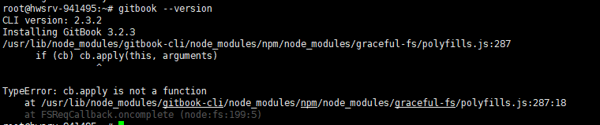
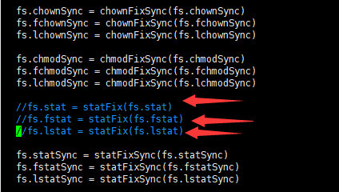

# Gitbook安装

## 安装gitbook

执行以下命名 耐心等待一会

```bash
npm install -g gitbook-cli
```

## 查看gitbook版本

```bash
gitbook --version
```

正常返回


## 错误解决

### polyfills错误



### 注释掉对应文件中如下代码

查看是否解决可以再次通过gitbook --version查看

