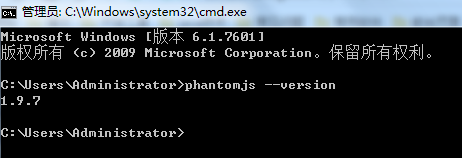

# 输出为其他格式文件

## 预备安装

### phantomjs

进入<https://bitbucket.org/ariya/phantomjs/downloads/>下载phantomjs：
将下载的压缩包解压，并将解压后的bin目录添加到环境变量。

安装完成后，查看版本：phantomjs --version
正常返回


### calibre

进入<https://calibre-ebook.com/download>下载适合自己电脑的calibre:
直接安装下载后的软件，安装步骤参考：<https://jingyan.baidu.com/album/6079ad0eb87aa328fe86db6a.html?picindex=1>，直接点击下一步即可，邮件什么的不用填写。并在将安装目录添加到环境变量中。Mac需要增加软连接。
默认位置：C:\Program Files (x86)\Calibre2
查看版本：calibre -v

## PDF

执行以下文件就会生成pdf文件在目录下

```bash
gitbook pdf # 默认目录
gitbook pdf ./mybook # 指定目录
```

## EPUB

执行以下文件就会生成EPUB文件在目录下

```bash
gitbook epub # 默认目录
gitbook epub ./mybook # 指定目录
```

## Mobi

执行以下文件就会生成Mobi文件在目录下

```bash
gitbook mobi # 默认目录
gitbook mobi ./mybook # 指定目录
```
