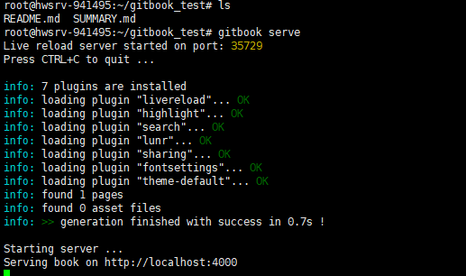

# Gitbook命令行速览

## 查看gitbook版本

```bash
gitbook --version
```

正常返回


## 初始化

新建一个文件夹，然后直接执行下面的初始化命令会报错

```bash
gitbook init
```


建议的方式还是自己先新建好两个文件README.md和SUMMARY.md
README.md是说明文档，SUMMARY.md是电子书的章节目录

## 启动

执行以下命令启动gitbook服务

```bash
gitbook serve
```

下图为成功执行



## 打包静态文件

执行以下命令打包静态文件，默认输出到_book/目录。当然输出目录是可配置的,暂不涉及,见高级部分.
打包完成后就可以自行部署到服务器或者github等网站进行托管

```bash
gitbook build
```

下图为成功执行


